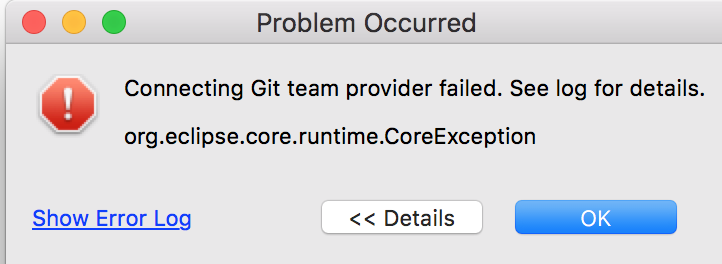
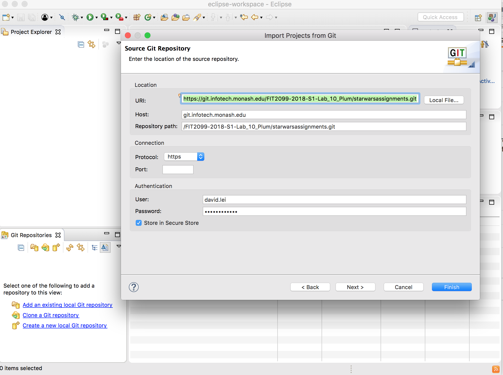
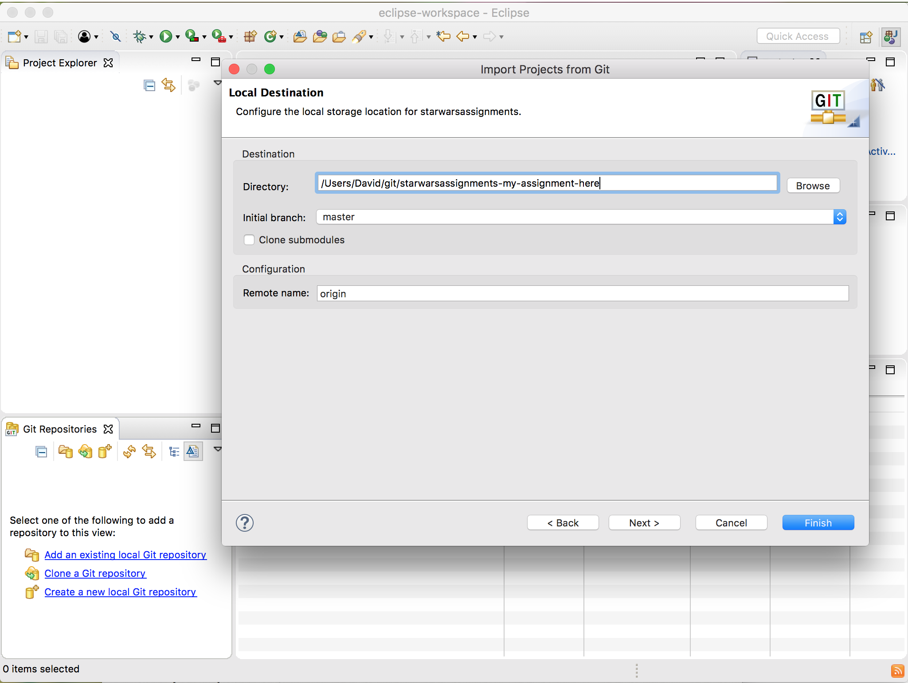
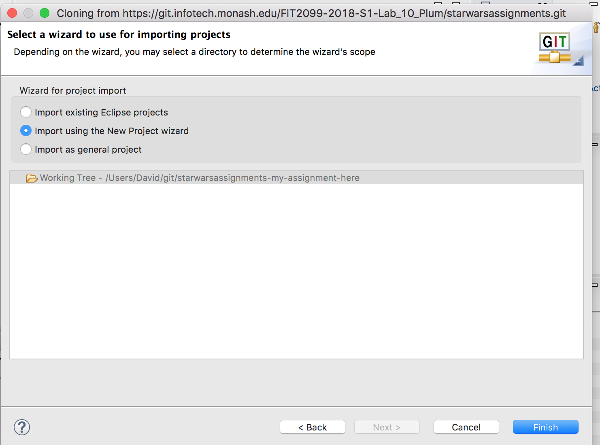
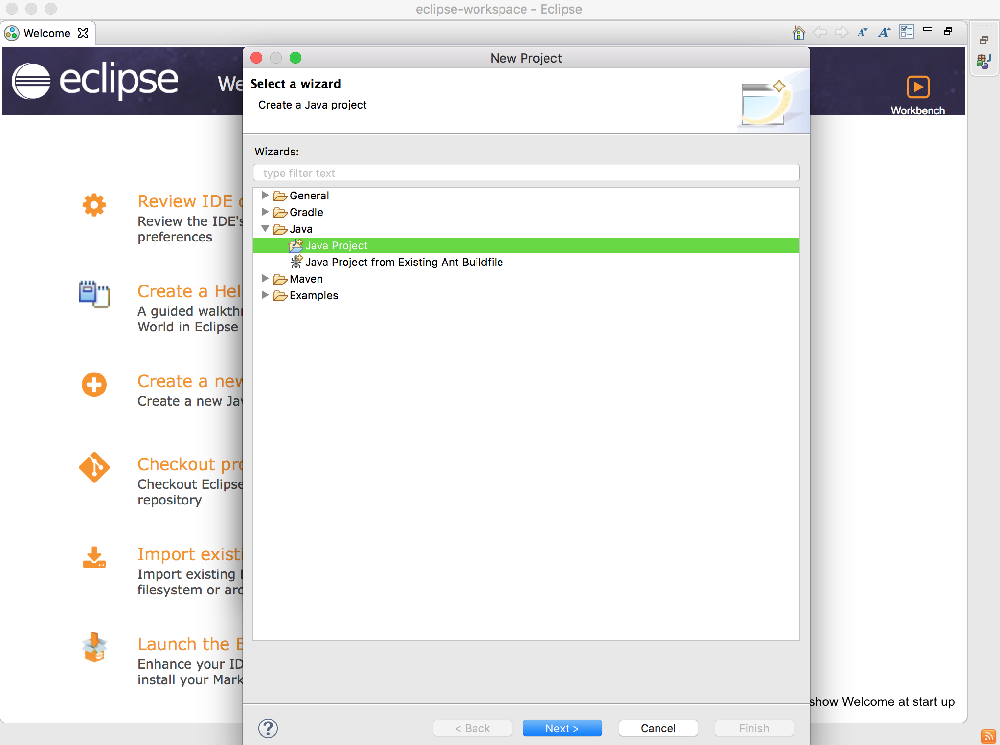
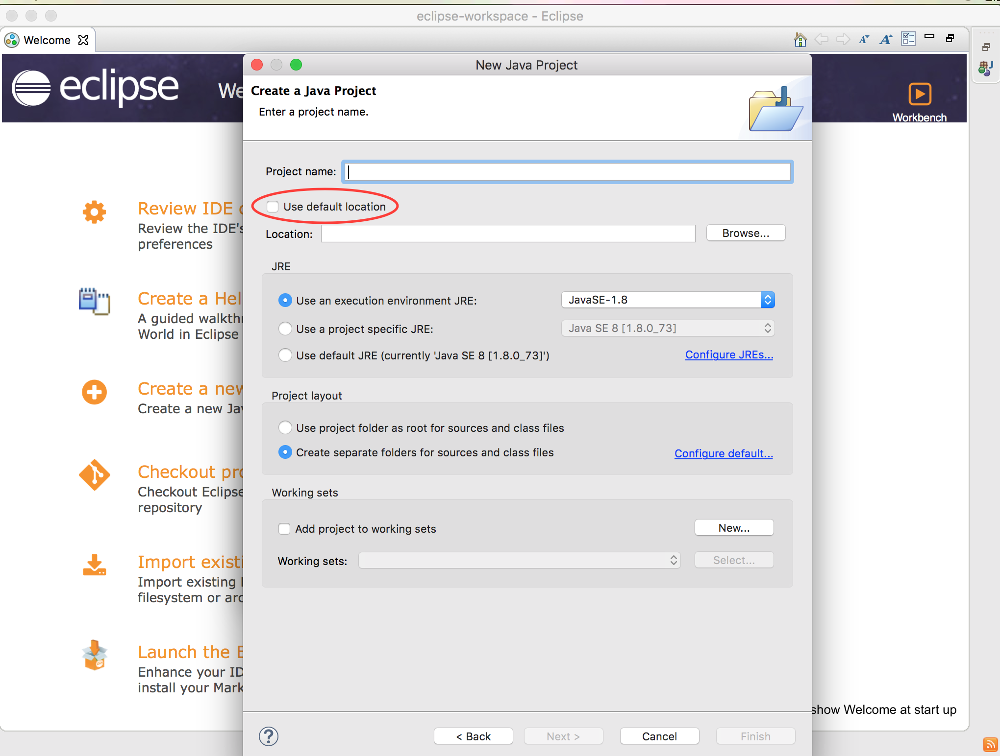
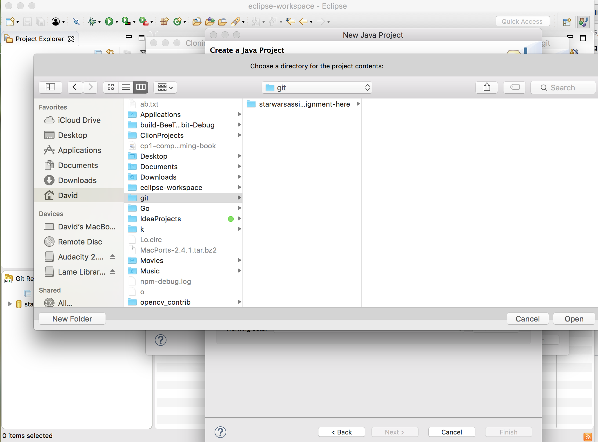

# Importing & running your project using git and Eclipse.

A few students have had problems when trying to import a project from git.

I've seen this pop up a few times.

Here is a workaround.

1. Go to file > import > git > projects from git and enter your gitlab url & authentication details

2. Click next twice and select where to store your project, remember this location.

In this case it is `/Users/David/git/starwarsassignments-my-assignment-here`

3. Click next, select import using the new project wizard and click finish

6. Select Java Project, then click next.

7. Untick `Use default location`

8. Select `Browse` and navigate to your project 

9. Select your project, open then click finish. You now should be able to right click and run `starwars.Application.java`

