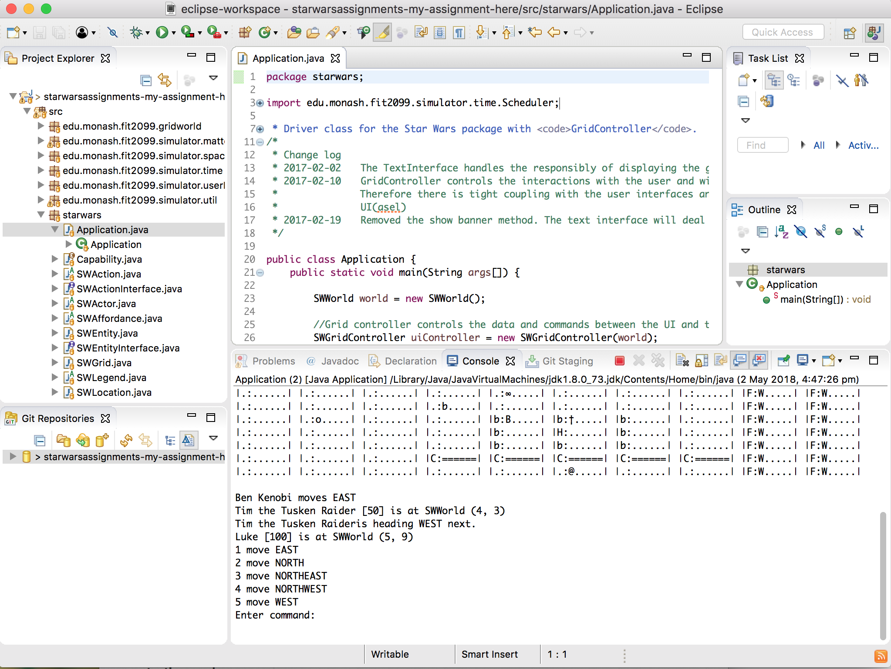

# Importing & running your project using git and Eclipse.

A few students have had problems when trying to import a project from git.

I've seen this pop up a few times.

Here is a workaround.

1. Go to file > import > git > projects from git and enter your gitlab url & authentication details

2. Click next twice and select where to store your project, remember this location.

In this case it is `/Users/David/git/starwarsassignments-my-assignment-here`

3. Click next, select import using the new project wizard and click finish

4. Select Java Project, click next, untick use default location and navigate to your project 

Make sure to untick `Use default location` and select `Browse` and navigate to where you selected to store your project.

5. Select your project and click finish, you now should be able to right click and run starwars.Application.java

